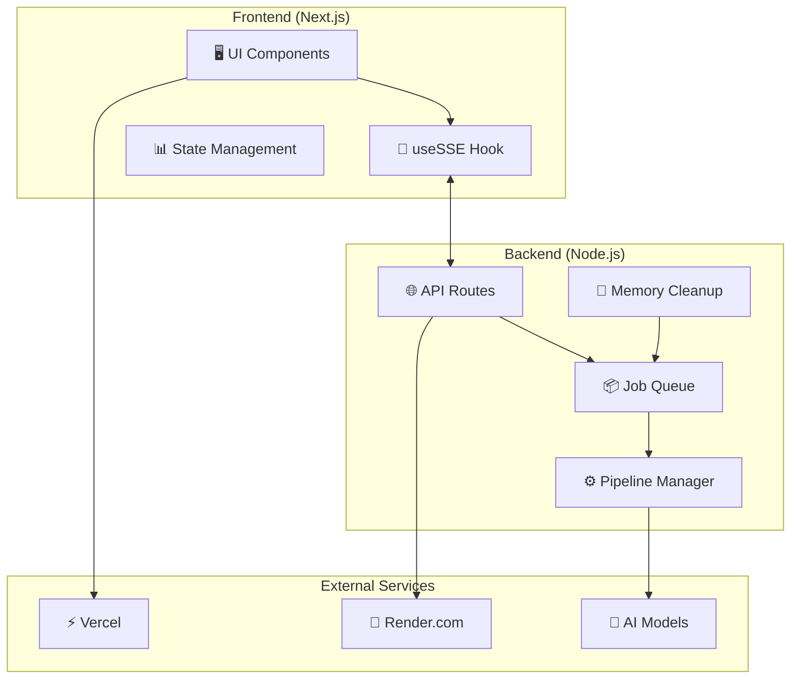

# AigileXperience Architecture Documentation

## Overview

This directory contains comprehensive architecture documentation for the AigileXperience platform, automatically generated and maintained through CodeRabbit AI reviews.

## Core Architecture Diagrams

### 🔌 [SSE Job Lifecycle](./sse-job-lifecycle.md)

Real-time job processing with robust Server-Sent Events implementation.

**Key Features:**

- Exponential backoff reconnection (1s → 15s)
- Idle guards (25s timeout) and hard timeouts (12min)
- Safari/Mobile optimized connection handling
- Production-ready error recovery

**Use Cases:**

- Understanding SSE event flows for debugging
- Frontend-Backend integration patterns
- Real-time UI update mechanisms

---

### 🧹 [Memory Management & Cleanup](./memory-management.md)

Automatic job cleanup system preventing memory leaks in production.

**Key Features:**

- 24h retention policy with 1000 job memory limit
- Hourly cleanup cycles with timer guards
- Accurate retention timing using `completedAt`
- Process-safe shutdown handling

**Use Cases:**

- Production memory optimization
- System monitoring and observability
- Cleanup policy configuration

---

## System Architecture Overview

## Benefits of This Documentation

### 🎯 **For Developers**

- **Quick Onboarding**: Visual flow understanding
- **Debugging Guide**: Clear event sequences for troubleshooting
- **Integration Patterns**: Reusable architecture patterns

### 🚀 **For Operations**

- **Monitoring**: Key metrics and failure points identified
- **Configuration**: Production-ready settings documented
- **Scaling**: Memory and performance characteristics clear

### 🤖 **AI-Enhanced Documentation**

- **Auto-Updated**: CodeRabbit maintains diagrams with code changes
- **Comprehensive**: Both happy path and error scenarios covered
- **Production-Ready**: Real-world constraints and optimizations included

## Contributing

These diagrams are automatically maintained by CodeRabbit AI during code reviews. When making architectural changes:

1. **Update Code First**: Make your implementation changes
2. **Create PR**: CodeRabbit will analyze the changes
3. **Review Diagrams**: CodeRabbit may update these diagrams automatically
4. **Manual Updates**: For significant changes, update diagrams manually and mention @coderabbitai

## Related Documentation

- [📚 Main README](../../README.md) - Project overview and setup
- [🔧 Deployment Guide](../deployment-flow.md) - Production deployment
- [🧪 Testing Strategy](../test-strategy.md) - QA and testing approach
- [🚨 Troubleshooting](../TROUBLESHOOTING.md) - Common issues and fixes
