# Memory Management & Job Cleanup Architecture

## Overview
This diagram illustrates the automatic cleanup system that prevents memory leaks by periodically removing old jobs and their associated artifacts.

## Architecture Diagram

```mermaid
sequenceDiagram
  autonumber
  participant T as ⏰ Timer<br/>(Hourly)
  participant Q as 📦 InMemoryJobQueue
  participant FS as 💾 Artifact Store<br/>(Memory)
  participant L as 📝 Logger

  Note over T,L: System Initialization
  T->>Q: 🚀 startPeriodicCleanup()
  Note over Q: Timer guard: prevent multiple intervals<br/>unref(): don't block process shutdown

  rect rgba(255,200,100,0.15)
    Note over T,L: Cleanup Cycle (Every Hour)
    
    loop Every 60 minutes
      T->>Q: ⚡ trigger cleanup()
      
      alt Jobs Need Cleanup
        Note over Q: 🔍 Scan for cleanup candidates
        Note right of Q: Criteria:<br/>• Age > 24h (retention)<br/>• Status: completed/failed<br/>• Count > 1000 jobs (max limit)
        
        Q->>Q: 📋 identify jobs to remove
        Note over Q: Use completedAt (not createdAt)<br/>for accurate retention timing
        
        Q->>FS: 🗑️ delete artifacts<br/>for pruned jobs
        Note over FS: Remove associated data:<br/>• Section artifacts<br/>• Cached results<br/>• Temporary files
        
        Q->>Q: 🧹 remove jobs from memory
        Note over Q: Clean removal from<br/>Map<jobId, JobData>
        
        Q->>L: 📊 log cleanup stats
        L->>L: ✅ "Removed {n} old jobs from memory"
        
      else Nothing to Clean
        Q->>L: ℹ️ "No cleanup needed"
        L->>L: 📝 "Removed: 0 jobs"
      end
    end
  end

  Note over Q: 💡 Cleanup Strategy
  Note over Q: • Retention: 24h after completion<br/>• Max Jobs: 1000 in memory<br/>• Priority: Oldest completed jobs first<br/>• Fail-Safe: Process shutdown won't hang
```



## Key Components

### 🧹 Cleanup Policies

| Policy | Value | Purpose |
|--------|-------|---------|
| **Retention Period** | 24 hours | Keep jobs for debugging/history |
| **Max Stored Jobs** | 1000 jobs | Prevent memory bloat |
| **Cleanup Frequency** | 60 minutes | Balance efficiency vs. memory |
| **Reference Time** | `completedAt` | Accurate retention calculation |

### 🔒 Memory Management Features

- **Timer Guards**: Prevent multiple cleanup intervals
- **Process Unref**: Don't block clean shutdown with `unref()`
- **Accurate Timing**: Use `completedAt` instead of `createdAt` for retention
- **Atomic Operations**: Clean artifact removal before job deletion

### 📊 Cleanup Logic Flow


### 🎯 Benefits

✅ **Memory Efficiency**: Prevents unbounded memory growth  
✅ **Performance**: Regular cleanup maintains optimal speed  
✅ **Reliability**: Guards against multiple cleanup processes  
✅ **Observability**: Detailed logging for monitoring  
✅ **Production-Safe**: Won't interfere with clean shutdowns  

### 🔧 Configuration

```typescript
// InMemoryJobQueue settings
const config = {
  maxStoredJobs: 1000,           // Memory limit
  jobRetentionMs: 24 * 60 * 60 * 1000,  // 24 hours
  cleanupIntervalMs: 60 * 60 * 1000,    // 1 hour
  useCompletedTime: true         // Accurate retention
}
```

## Error Handling

- **Cleanup Failures**: Logged but don't crash the system
- **Artifact Conflicts**: Graceful handling of missing files  
- **Timer Issues**: Robust interval management with guards
- **Memory Pressure**: Prioritized cleanup under load
