# SSE Job Lifecycle Architecture

## Overview

This diagram shows the complete flow from user interaction to real-time job progress updates via Server-Sent Events (SSE).

## Architecture Diagram

```mermaid
sequenceDiagram
  autonumber
  participant U as 👤 User
  participant FE as 🖥️ Frontend<br/>(auto/page.tsx)
  participant SSE as 🔌 useSSE Hook
  participant API as 🌐 Backend API
  participant Q as 📦 InMemoryJobQueue

  Note over U,Q: Job Creation Phase
  U->>FE: Click "Generate (Auto)"
  FE->>API: POST /api/jobs<br/>{title, pitch, use_assumptions}
  API->>Q: enqueue(job)
  Q-->>API: ✅ { jobId }
  API-->>FE: 201 { jobId }

  Note over FE,SSE: SSE Connection Phase
  FE->>SSE: start(jobId, listeners)

  rect rgba(100,200,255,0.15)
    Note over SSE,API: Real-time Streaming Phase
    SSE-->>API: 🔗 GET /api/jobs/{jobId}/stream<br/>(EventSource)

    loop Job Processing Events
      API-->>SSE: 📊 event: progress<br/>{step, percentage}
      SSE->>FE: 🔄 onProgress(step, status)
      Note right of FE: UI updates:<br/>setSecState(running)

      API-->>SSE: 📄 event: artifact_written<br/>{section, data}
      SSE->>FE: 💾 onArtifactWritten(update + persist)
      Note right of FE: localStorage.setItem<br/>setSecState(done)

      API-->>SSE: 📋 event: result<br/>{final}
      SSE->>FE: ✅ onResult(set state)

      alt Job Completes Successfully
        API-->>SSE: 🎉 event: done<br/>{summary}
        SSE->>FE: 🏁 onDone(merge, finalize)
        Note right of FE: All sections done<br/>Stages: S1-S4 complete
      else Job Fails
        API-->>SSE: ❌ event: error<br/>{message}
        SSE->>FE: 🚨 onError(mark error)
        Note right of FE: Error state<br/>User notification
      end
    end
  end

  Note over SSE: 🔄 Resilience Features
  Note over SSE: • Idle Guard (25s timeout)<br/>• Hard Timeout (12min max)<br/>• Exponential Backoff (1s→15s)<br/>• Auto-reconnect on connection loss

  alt Connection Issues
    SSE->>SSE: 🔄 Reconnect with backoff
    Note over SSE: Safari/Mobile optimized<br/>Proxy/timeout handling
  end
```

## Key Components

### 🔌 useSSE Hook Features

- **Idle Guard**: Auto-reconnect after 25s without events
- **Hard Timeout**: 12min failsafe to prevent infinite connections
- **Exponential Backoff**: 1s → 2s → 4s → 8s → 15s (capped)
- **Safari/Mobile Friendly**: Handles browser-specific connection issues

### 📡 Event Types

| Event              | Purpose            | UI Impact                        |
| ------------------ | ------------------ | -------------------------------- |
| `progress`         | Step updates       | Progress bars, status indicators |
| `artifact_written` | Section completion | Individual section marked done   |
| `result`           | Final output       | Complete data available          |
| `done`             | Job finished       | All UI finalized                 |
| `error`            | Failure state      | Error message displayed          |

### 🎯 Error Handling

- **Connection Loss**: Automatic reconnection with backoff
- **Timeout Protection**: Hard limits prevent hanging connections
- **Browser Compatibility**: Special handling for Safari/mobile quirks
- **User Feedback**: Clear error states and retry indicators

## Benefits

✅ **Reliability**: Robust reconnection handles network issues  
✅ **Performance**: Efficient streaming reduces polling overhead  
✅ **UX**: Real-time feedback keeps users engaged  
✅ **Mobile-First**: Optimized for unstable mobile connections  
✅ **Production-Ready**: Comprehensive error handling and timeouts
