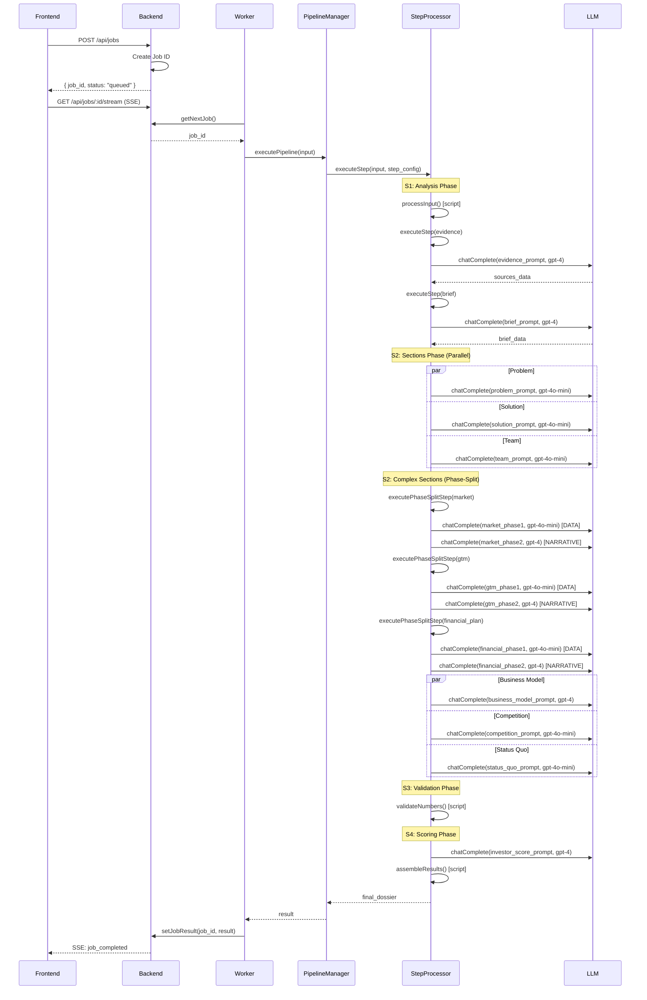
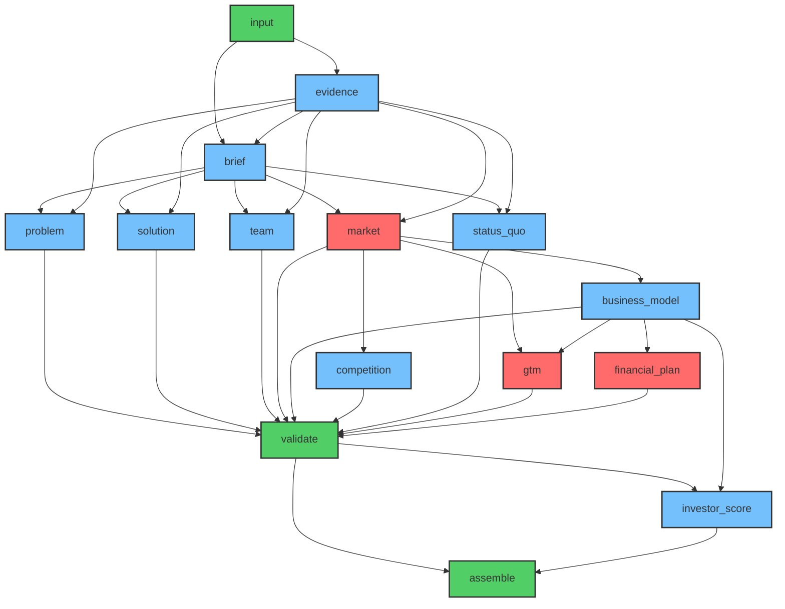

# Pipeline Process Documentation

## Pipeline Sequence Diagram

## Step → Prompt → Model → Phase → Filter Table

| Step | Prompt File | Model | Context | Phase | Source Filter | RateGate Limit |
|------|-------------|-------|---------|-------|---------------|----------------|
| input | - | - | - | - | - | - |
| evidence | 10_evidence_harvester.md | LLM_MODEL_EVIDENCE \|\| gpt-4 | 128k | single | none | 30k TPM |
| brief | 20_extract_brief.md | LLM_MODEL_BRIEF \|\| gpt-4 | 128k | single | evidence-based | 30k TPM |
| problem | 30_problem.md | LLM_MODEL_PROBLEM \|\| gpt-4o-mini | 128k | single | problem-focused | 200k TPM |
| solution | 31_solution.md | LLM_MODEL_SOLUTION \|\| gpt-4o-mini | 128k | single | solution-focused | 200k TPM |
| team | 32_team.md | LLM_MODEL_TEAM \|\| gpt-4o-mini | 128k | single | team-focused | 200k TPM |
| market | 33_market.md | LLM_MODEL_MARKET \|\| gpt-4 | 128k | **SPLIT** | market-keywords | 30k TPM |
| ├─ phase1 | 33_market.md_phase1.txt | LLM_MODEL_MARKET_PHASE1 \|\| gpt-4o-mini | 128k | data | market-data | 200k TPM |
| └─ phase2 | 33_market.md_phase2.txt | LLM_MODEL_MARKET_PHASE2 \|\| gpt-4 | 128k | narrative | none | 30k TPM |
| business_model | 34_business_model.md | LLM_MODEL_BUSINESS_MODEL \|\| gpt-4 | 128k | single | business-focused | 30k TPM |
| competition | 35_competition.md | LLM_MODEL_COMPETITION \|\| gpt-4o-mini | 128k | single | competition | 200k TPM |
| status_quo | 37_status_quo.md | LLM_MODEL_STATUS_QUO \|\| gpt-4o-mini | 128k | single | status-focused | 200k TPM |
| gtm | 36_go-to-market.md | LLM_MODEL_GTM \|\| gpt-4o-mini | 128k | **SPLIT** | marketing-keywords | 200k TPM |
| ├─ phase1 | 36_go-to-market.md_phase1.txt | LLM_MODEL_GTM_PHASE1 \|\| gpt-4o-mini | 128k | data | marketing-data | 200k TPM |
| └─ phase2 | 36_go-to-market.md_phase2.txt | LLM_MODEL_GTM_PHASE2 \|\| gpt-4 | 128k | narrative | none | 30k TPM |
| financial_plan | 38_financial_plan.md | LLM_MODEL_FINANCIAL_PLAN \|\| gpt-4 | 128k | **SPLIT** | financial-keywords | 30k TPM |
| ├─ phase1 | 38_financial_plan.txt_phase1.txt | LLM_MODEL_FINANCIAL_PLAN_PHASE1 \|\| gpt-4o-mini | 128k | data | financial-data | 200k TPM |
| └─ phase2 | 38_financial_plan.txt_phase2.txt | LLM_MODEL_FINANCIAL_PLAN_PHASE2 \|\| gpt-4 | 128k | narrative | none | 30k TPM |
| validate | - | - | - | - | - | - |
| investor_score | 90_investor_scoring.md | LLM_MODEL_INVESTOR_SCORE \|\| gpt-4 | 128k | single | scoring-focused | 30k TPM |
| assemble | - | - | - | - | - | - |

## DAG Dependencies & Rebuild Triggers

### Rebuild Triggers

| Change | Affected Steps | Reason |
|--------|---------------|---------|
| pitch text | ALL | Hash change triggers full rebuild |
| sources | brief → all sections | Evidence dependencies cascade |
| brief | all sections | Brief is input to all sections |
| market | business_model, competition, gtm, financial_plan | Market data drives business logic |
| business_model | gtm, financial_plan, investor_score | Business model shapes strategy |

## Source Filter Rules by Step

| Step | Keywords | Max Sources | Max Chars/Source |
|------|----------|-------------|------------------|
| evidence | (all) | 15-20 | unlimited |
| brief | (evidence-based) | 8 | 800 |
| problem | problem, issue, challenge, pain | 6 | 600 |
| solution | solution, product, technology, approach | 6 | 600 |
| team | team, founder, experience, background | 4 | 600 |
| market | market, industry, sector, size, growth | 8 | 800 |
| business_model | revenue, pricing, model, monetization | 6 | 600 |
| competition | competitor, alternative, comparison | 6 | 600 |
| status_quo | current, existing, traditional | 4 | 600 |
| gtm | marketing, sales, customer, channel | 6 | 600 |
| financial_plan | financial, funding, revenue, cost | 8 | 800 |
| investor_score | (all sections) | 8 | 600 |

## Context Length Guards

| Model | Max Context | Used For | Fallback |
|-------|-------------|----------|----------|
| gpt-3.5-turbo | ❌ 4k | NEVER | gpt-4o-mini |
| gpt-4o-mini | ✅ 128k | Simple sections | - |
| gpt-4o | ✅ 128k | Complex sections | - |
| gpt-4 | ✅ 128k | Critical sections | - |
| gpt-4-turbo | ✅ 128k | Heavy workloads | gpt-4 |

**HARD RULE**: No model with ≤ 8192 context for market, gtm, financial_plan steps.
